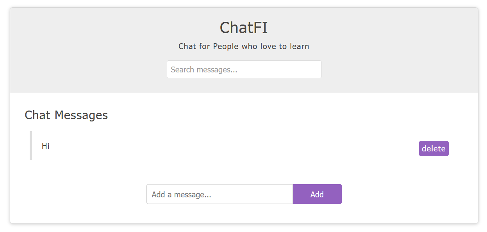

# SocketIO Learning Flask Project

This is a learning project for **Websockets** and **SocketIO**. Uses **Flask** for web server.



### Usage:

```python
pip install -r requirements.txt
python main.py
```

Then go to http://127.0.0.1 and chat with your friends.

### References:

- https://youtu.be/1BfCnjr_Vjg
- https://blog.miguelgrinberg.com/post/easy-websockets-with-flask-and-gevent
- https://flask-socketio.readthedocs.io/en/latest/getting_started.html
- https://github.com/iamshaunjp/JavaScript-DOM-Tutorial/tree/lesson-18
